# Chidori 組立説明書

_The English version of the build guide is [here](README_en.md)._

 Chidori 拡張キットの組立説明書は[こちら](https://github.com/ka2hiro/chidori_expansion_build_guide/blob/master/README.md) を参照してください。

## 組み立ての前に
* はんだごてや工具、部品等でのケガに注意してください。
* 作業中に席を離れるときは、はんだごての電源を確認してください。
* 非常に小さい部品が含まれていますので、失くさないように注意してください。

## 内容物の確認
キットには以下の部品が含まれています。作業前に不足がないか確認してください。

番号 | 画像 | 名前      | 値     | 個数 | 備考                | 部品番号（マスタ側） | 部品番号（スレーブ側） 
:----|:------|:--------|:-----|:----|:-----------------|:-------|:-------
1 || PCB      |       | 2    | マスタ、スレーブ1枚ずつ         | |
2 |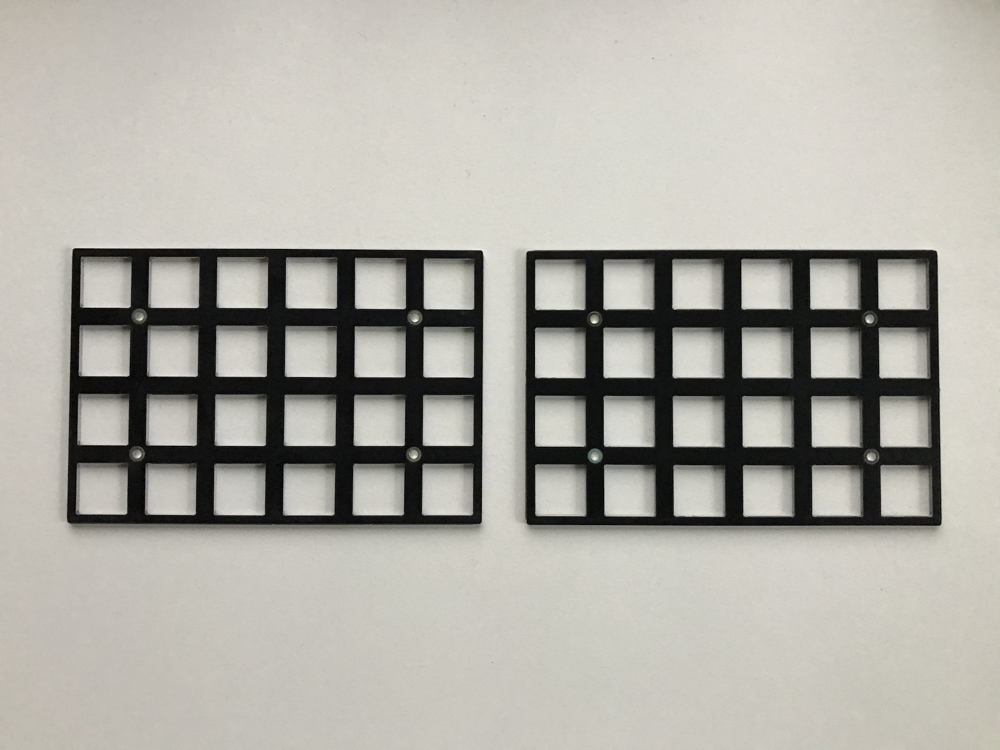| トッププレート |  | 2 |           | | 
3 || ボトムプレート |     | 2 |        | | 
4 || アクリルプレート |  | 2 |        | | 
5 || MPU | ATMEGA328P | 1 |    | U1 | 
6 || I2C IO エキスパンダー| MCP23017 | 1 |  |  | U1 
7 || ICソケット |  | 2 |   | | 
8 || 水晶発振子 | 16 MHz | 1 |    | Y1 | 
9 || ポリスイッチ | RXEF005 | 1 |    | F1 | 
10 || タクトスイッチ（白） |  | 1 |   | RESET | 
11 || タクトスイッチ（黒） |  | 1 |   | BOOT | 
12 || TRRS ジャック | MJ-4PP-9 | 4 | | J2, J3 | J1, J2 
13 || DIPスイッチ | KSD42 | 1 | | | SW28 
14 || USBコネクタ | 54819-0519 | 1 |    | J1 | 
15 || LED（緑） | OSG8HA3Z74A | 2 |   | LED1 | LED1 
16 |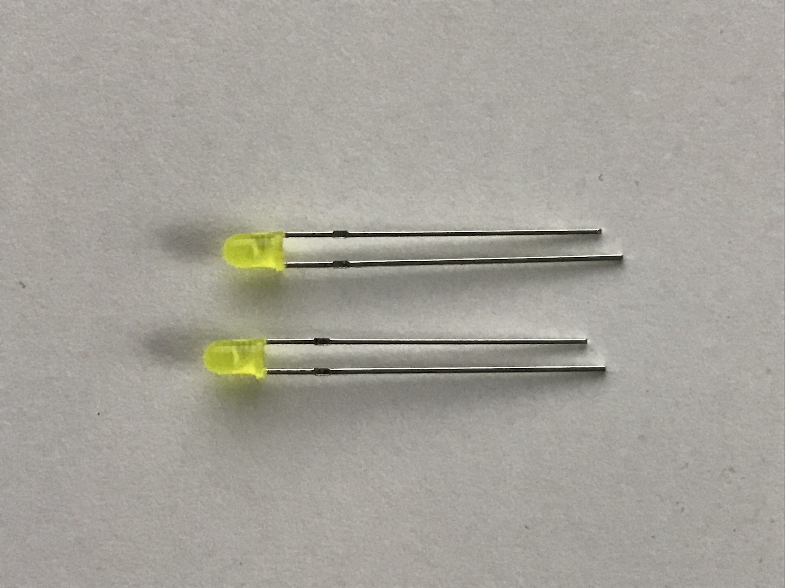| LED（黄） | OSY5JA3Z74A | 2 |   | LED1 | LED1 
17 |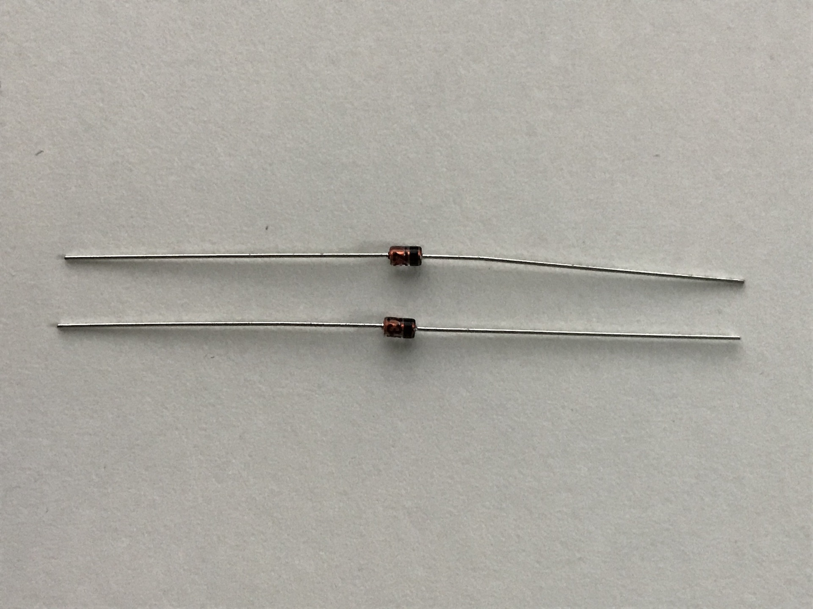| ツェナーダイオード | 3.6V | 2 | 1N4148と区別が付きにくいので混在注意 | D25, D26 | 
18 || 電解コンデンサ | 10μF | 1 |   | C1 | 
19 || コンデンサ | 1μF | 3 | 本体に105と表記 | C2 | C1, C2 
20 || コンデンサ | 0.1μF | 2 | 本体に104と表記 | C3 | C3 
21 |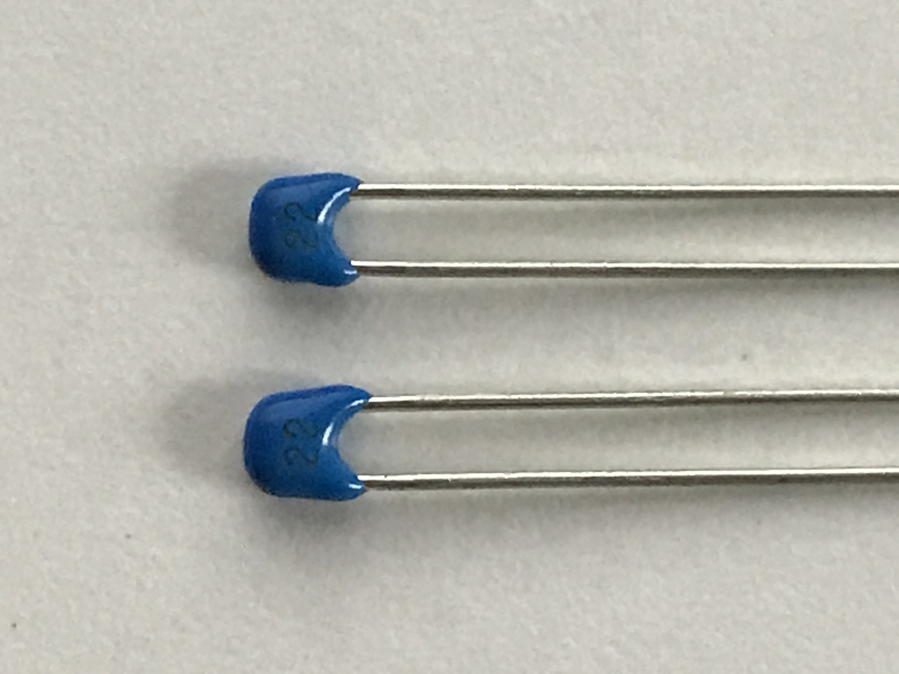| コンデンサ | 22pF | 2 | 本体に22と表記 | C4, C5 | 
22 || 抵抗 | 10kΩ | 5 | カラーコードは茶黒橙金  | R1 | R3, R4, R5, R6 
23 |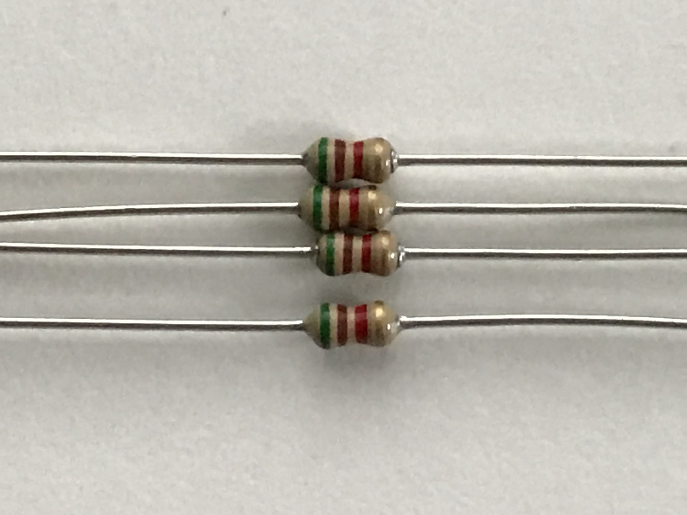| 抵抗 | 5.1kΩ | 4 | カラーコードは緑茶赤金 | R7, R8 | R1, R2 
24 || 抵抗 | 2.2kΩ | 2 | カラーコードは赤赤赤金  | R5, R6 | 
25 || 抵抗 | 1.5kΩ | 1 | カラーコードは茶緑赤金  | R2 | 
26 |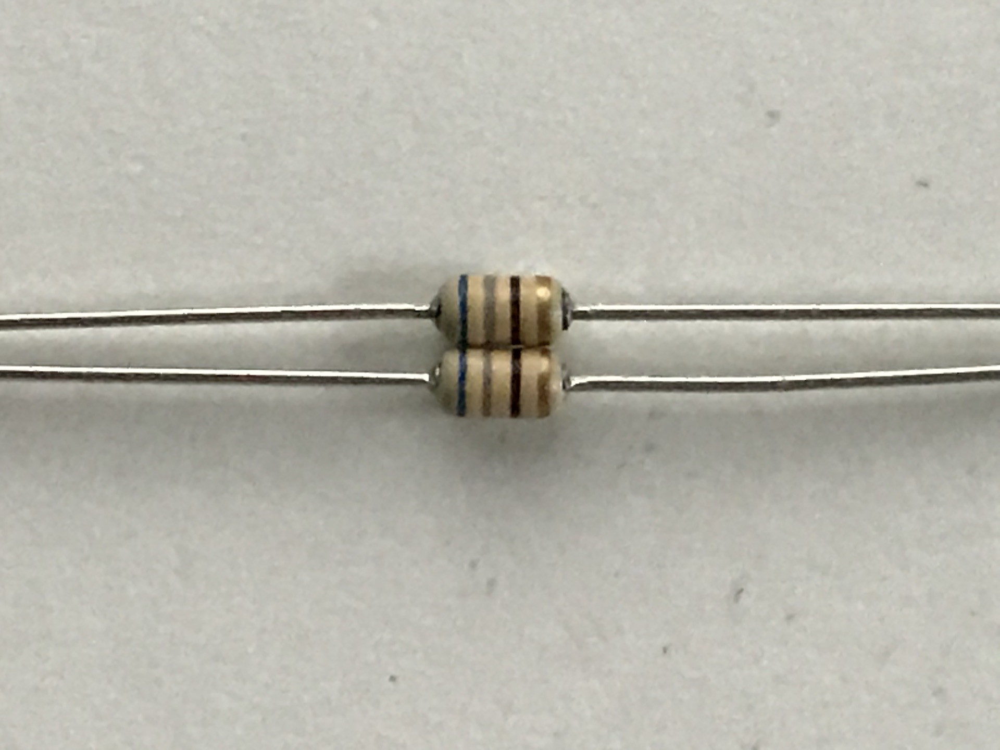| 抵抗 | 68Ω | 2 | カラーコードは青灰黒金  | R3, R4 | 
27 || ダイオード | 1N4148 | 48 |ツェナーダイオードと区別がつきにくいの混在注意 | D1 - D24 | D1 - D24 
28 |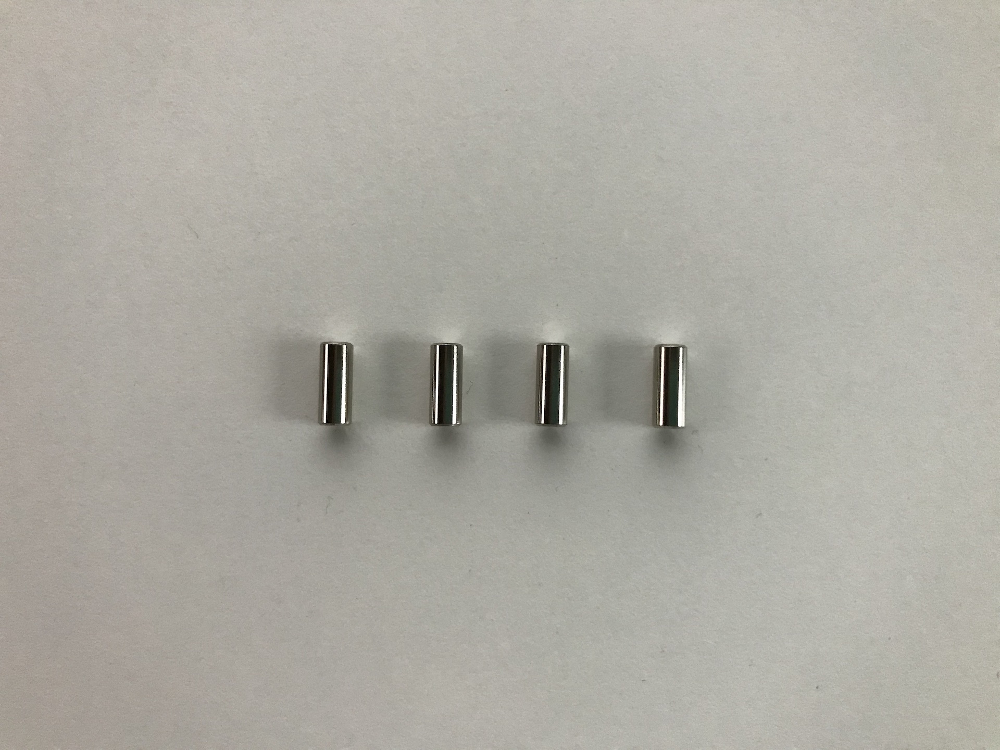| M2スペーサ | 10mm | 4 |                   | | 
29 |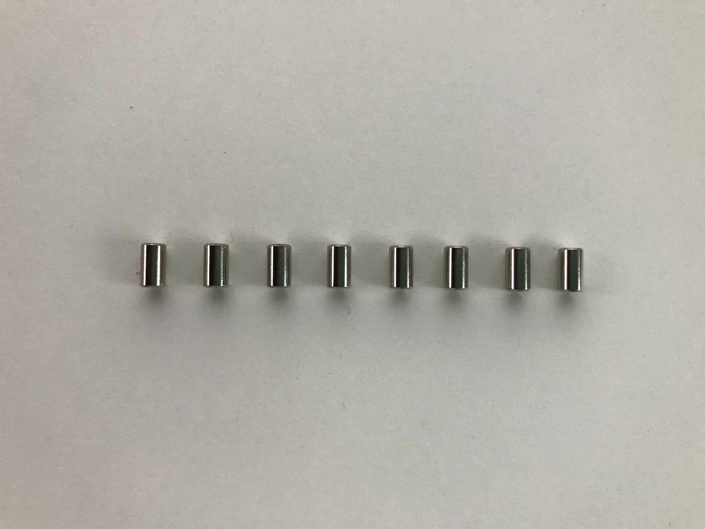| M2スペーサ | 7mm | 8 |                   | | 
30 || M2ネジ    | 4mm | 24 |                   | | 
31 || ゴム足 |      | 8 |                | | 
32 |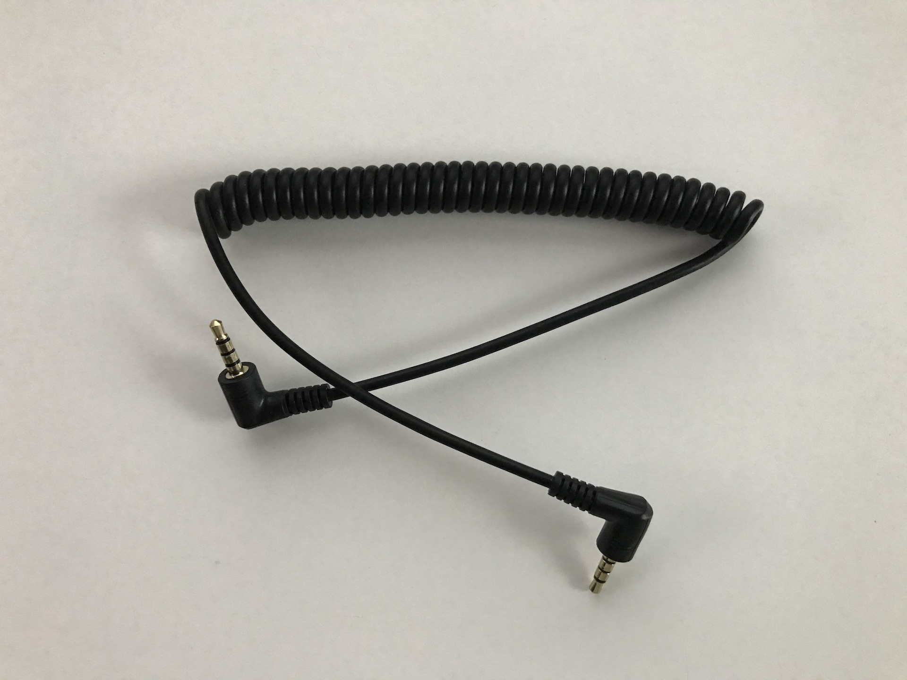| TRRSケーブル  |       | 1 |     | | 
33 || USB MiniBケーブル  |       | 1 |     | | 

## その他に必要なもの
キットを完成させるためには、以下の部品を別途用意する必要があります。

* キースイッチ（Cherry MX互換スイッチ）
* キーキャップ

## 作業に必要な工具
組立作業には、最低限以下の工具が必要となります。

* はんだごて（温度調節できるものが望ましい）
* はんだ
* ピンセット
* プラス(+)ドライバ
* ルーペ
* フラックス
* テスタ

その他、必要に応じて以下も用意すると良いです。

* フラックス洗浄剤
* はんだ吸取線または吸取機

## 組み立て時の注意
* マスタ（USBコネクタの付いている側）とスレーブでは使用部品が異なります。手順に「マスターのみ」、「スレーブのみ」と表記されている場合がありますので、注意してください。
* 以下、マスタとスレーブを両方同時に組み立てる想定で手順が書かれていますが、別々に組み立てることももちろん可能です。お好きな方法で組み立ててください。別々に組み立てる場合は、それぞれに必要なステップ以外は読み飛ばして進めてください。
* 取り付ける向きに注意が必要な部品があります。手順にその旨記載されている場合は、よく確認して作業してください。

## 抵抗をつける
1. マスタ側の抵抗R1〜R8をはんだ付けします。

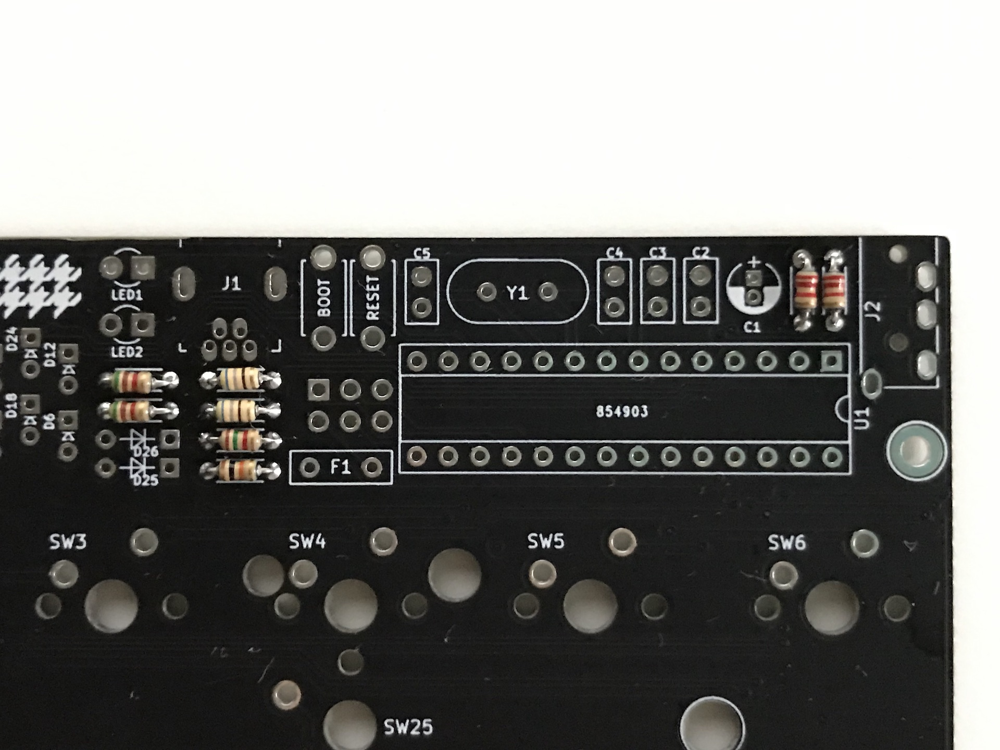

2. スレーブ側の抵抗R1〜R6をはんだ付けします。

## ツェナーダイオードをつける（マスターのみ）
**ダイオードには向きがあるので注意してください。**

1. マスタ側のツェナーダイオードD25、D26をはんだ付けします。ダイオード本体の黒いバーが四角いパッドへ向くよう取り付けてください。

## 水晶発振子をつける（マスターのみ）
1. マスタ側の水晶発振子Y1をはんだ付けします。

## コンデンサをつける
1. マスタ側のコンデンサC2〜C5をはんだ付けします。

2. スレーブ側のコンデンサC1〜C3を半田付けします。

## 電解コンデンサをつける（マスターのみ）
**電解コンデンサには向きがありますので注意してください。 **

1. マスタ側の電解コンデンサC1をはんだ付けします。リードの長いほうが（+）へ向くように取り付けてください。

## リセッタブルフューズをつける（マスターのみ）
1. マスタ側のリセッタブルフューズF1をはんだ付けします。
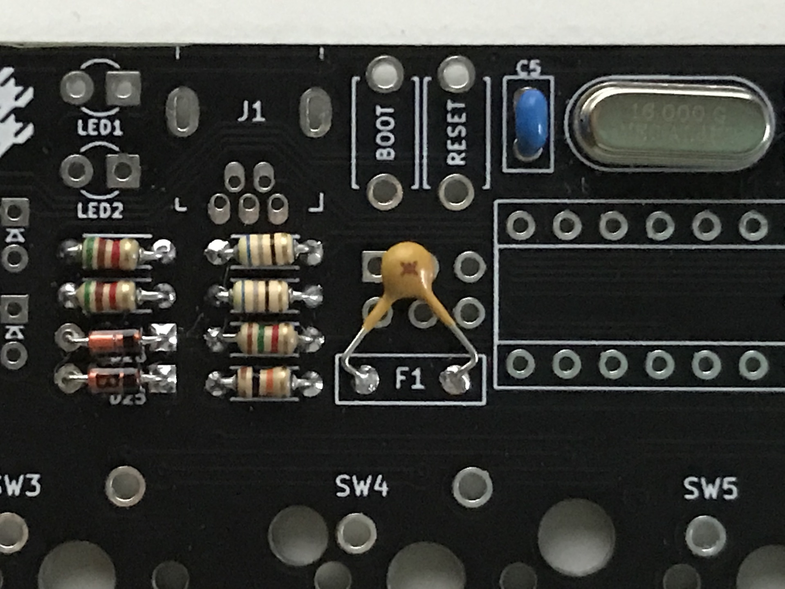

## ダイオードをつける
**ダイオードには向きがありますので注意してください。**

1. ダイオードは縦に実装しますので、あらかじめ次の画像のように、カソード（黒いバーのある側）のリードを曲げておきます。

2. PCBにダイオードを取り付ける際は、丸いランドの上に本体が来るよう差し込みます。
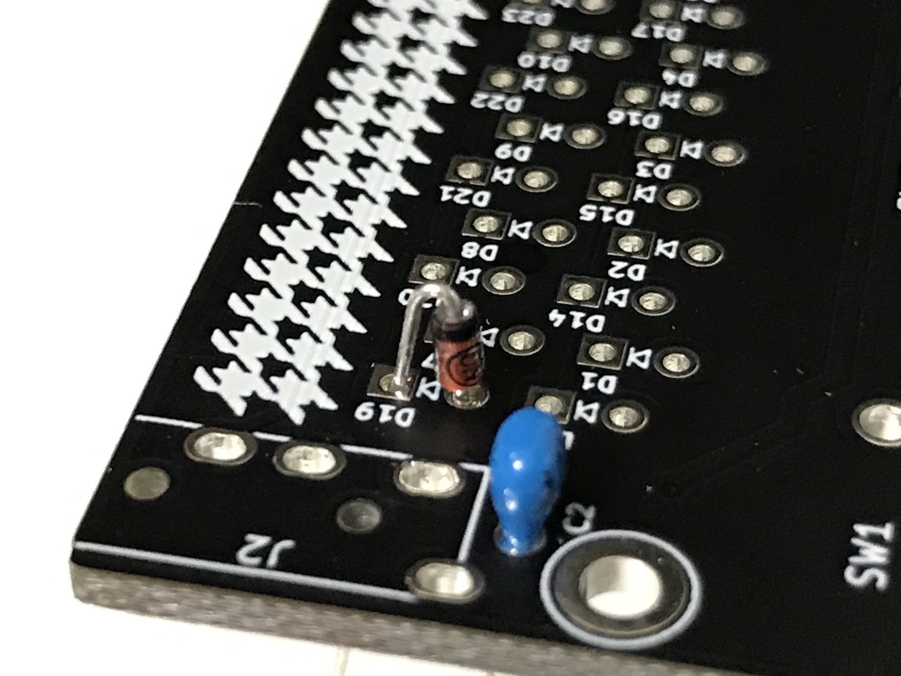

3. マスタ側のダイオードD1からD24をはんだ付けします。
4. スレーブ側のダイオードD1からD24をはんだ付けします。

## LEDをつける
**LEDには向きがありますので注意してください**

1. マスタ側のLED1（緑）, LED2（黄）を半田付けします。リードの長い方が丸いパッドの方を向くように取り付けてください。

2. スレーブ側のLED1（緑）, LED2（黄）を半田付けします。リードの長い方が丸いパッドの方を向くように取り付けてください。

## タクトスイッチをつける（マスターのみ）
1. マスタ側のタクトスイッチ（黒）と（白）を半田付けします。
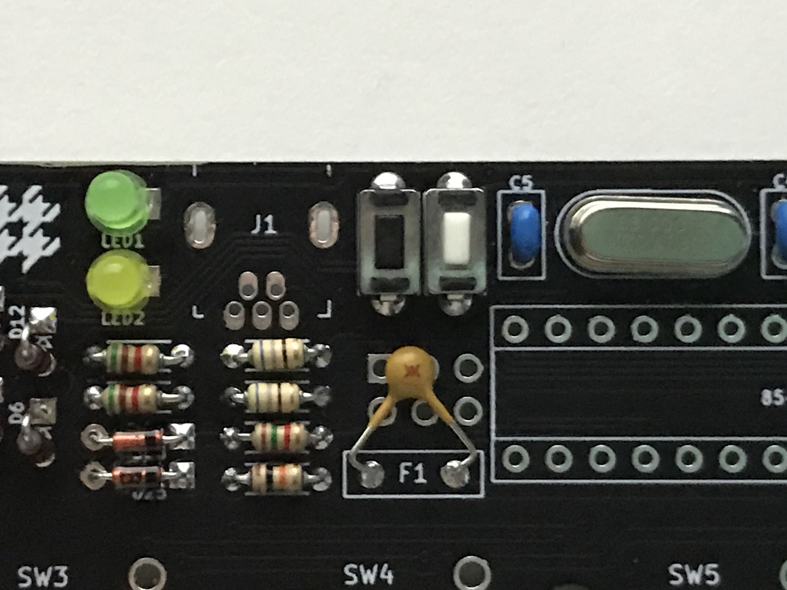

## DIPスイッチをつける（スレーブのみ）
1. スレーブ側のDIPスイッチを半田付けします。

2. DIPスイッチの設定は以下の通り、1をOff（下）、2から4をOn（上）にします。
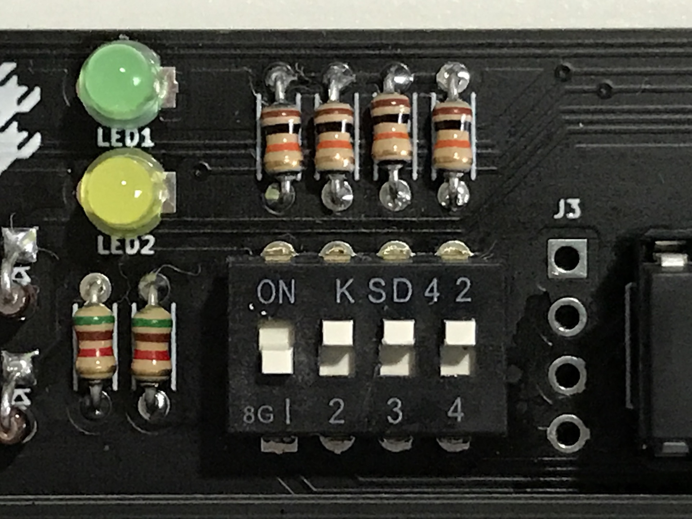

## USBコネクタをつける（マスターのみ）
1. マスタ側のUSBコネクタを半田付けします。

## TRRSジャックをつける
1. マスタ側のTRRSジャックを半田付けします。

2. スレーブ側も同様に半田付けします。
  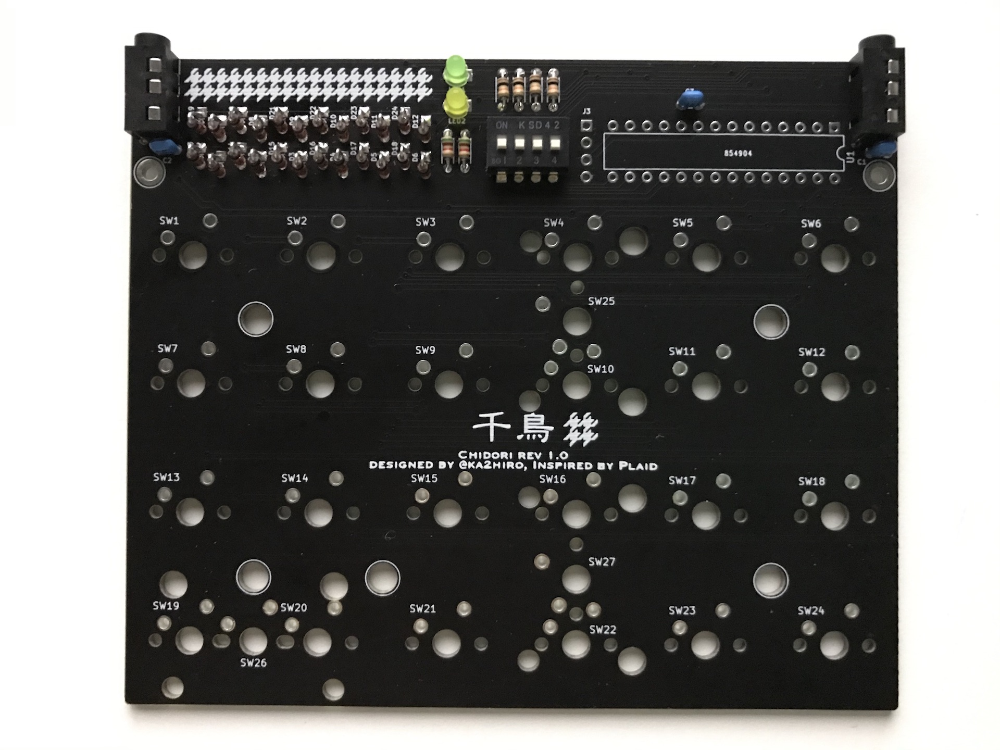

  

## ICソケットをつける
**ICソケットには向きがありますので注意してください。**

1. マスタ側の ICソケットを半田付けします。ICソケットの切り欠きが右に向くように取り付けてください。

2. スレーブ側も同様に半田付けします。

## ATMEGA328PとMCP23017をつける
**ICには向きがありますので注意してください**

1. マスタ側の ICソケットにATMEGA328Pを、スレーブ側のICソケットにMCP23017を、それぞれ差し込みます。
2. ICのピンはICソケットより広がっているので、少し内側に曲げてから差し込みます。
3. ICの向きを間違えないよう、ICと ICソケットの切り欠きの位置を合わせてください。

## 正しくはんだ付けされているか確認する
回路図( [左側](files/chidori_master.pdf) 、[右側](files/chidori_slave.pdf))を参考に、正しくはんだ付けされているか確認します。

コンピュータに接続する前に、少なくとも以下の項目は確認しましょう。

1. VCCーGND間がショートしていないことを確認します。
2. USBコネクタの端子がブリッジしていないこと確認します。
3. ATMEGA328P、MCP23017、電解コンデンサ、LED、ダイオードが正しい向きに取り付けられていることを確認します。

## USBデバイスとして認識されることを確認する
キーボードをコンピュータに接続すると、**緑色のLEDが点灯**しますので確認してください。

次に以下の操作を行ってブートローダモードに入り、USBデバイスとして認識されることを確認します。

1. BOOTスイッチ（黒）を押したままにする
2. RESETスイッチ（白）を押して、離す
3. BOOTスイッチ（黒）を離す

ブートローダモードに入ると、**黄色のLEDが点滅**します。点滅しない場合は、上記の操作をゆっくりと繰り返してみてください。

### Macの場合
* Macの場合は、「システム情報」を起動して、「USBasp」というデバイスが見えているか確認します。
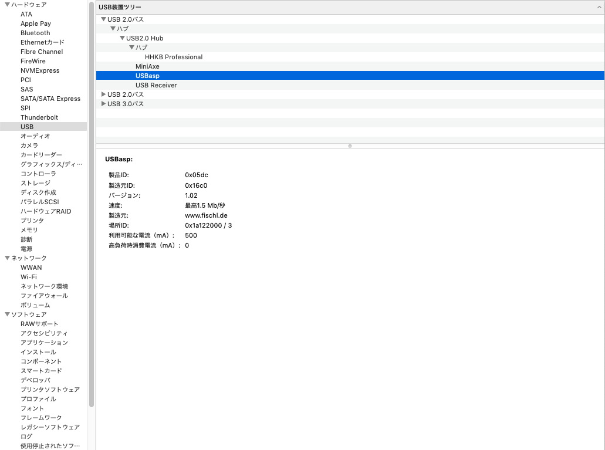

### Windowsの場合
* Windowsの場合は、libusbKドライバのインストールが必要です。以下のサイトからインストールツールをダウンロードし、セットアップしてください。
	* [Zadig - インストールツール](https://zadig.akeo.ie/)
	* [セットアップ方法](https://ht-deko.com/arduino/usbasp.html)

* 「デバイスマネージャ」を起動して、「USBasp」というデバイスが見えているか確認します。
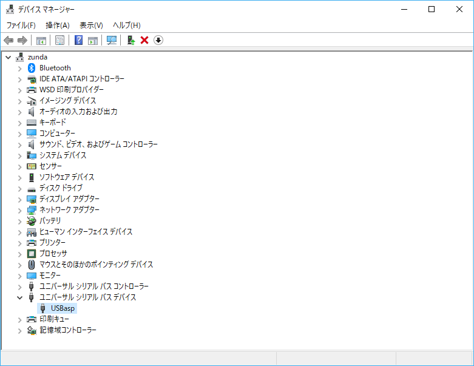

ブートローダモードに入らない場合やUSBデバイスとして認識されない場合は、全ての部品が正しくはんだ付けされているか、回路図を参考に再度確認してください。

## スイッチをつける
1. スイッチをトッププレートにはめ込みます。

2. トッププレートとPCBを組み合わせます。キースイッチをPCBにしっかりと押し込み、キースイッチの底面がPCBから浮いていないか確認してから、はんだ付けします。

## アクリルプレート用のスペーサをつける
1. TRRSジャックの近くにあるねじ穴に、アクリルプレート用のスペーサM2x10mmを取り付けます。

## ボトムプレートをつける
1. ボトムプレートはリバーシブルになっていますので、お好みの面を外側にしてお使いいただけます。
2. M2x4mmねじをボトムプレートに差し込み、スペーサを取り付けます。
  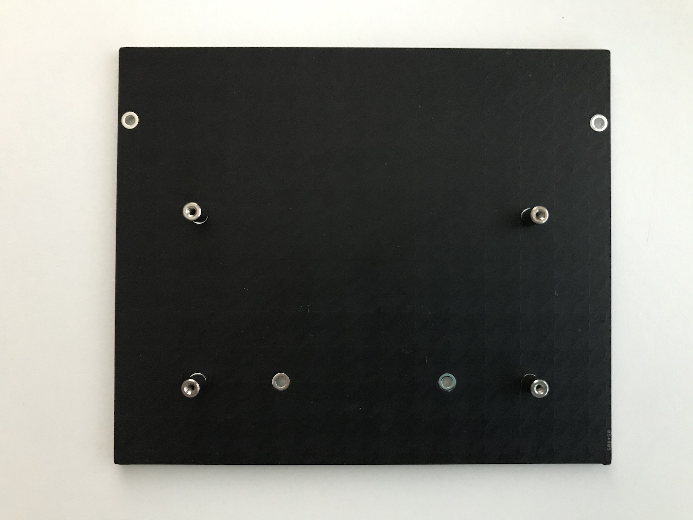
3. ボトムプレートの上にトッププレートとPCBを重ね合わせ、M2x4mmねじで留めます。
  

## ゴム足をつける
1. ゴム足をボトムプレートにつけます。

## キーキャップをつける
1. お好みのキーキャップを取り付けます。

## ファームウェアを書き込む
ファームウェアはQMKを利用します。QMK本体にはまだマージされていませんので、以下のリポジトリをクローンし、"chidori_support" ブランチをチェックアウトしてビルドしてください。

[qmk_firmware](https://github.com/ka2hiro/qmk_firmware)

チェックアウトしたら、ローカルリポジトリのディレクトリへ移動してください。

次にキーボードをコンピュータに接続し、ブートローダモードに入ってください。

以下のコマンドを実行すると、ファームウェアの書き込みが始まります。書き込みに失敗する場合は、再度コマンドを実行してみてください。

~~~
$ make chidori:default:usbasp
~~~

書き込みが完了したら、RESETスイッチ（白）を押して、ブートローダモードから抜けてください。

ファームウェアをビルドする環境の構築は、[こちらのドキュメント](https://docs.qmk.fm/#/getting_started_build_tools)を参考にしてください。

## 完成！
アクリルカバーをつけると完成です。おつかれさまでした。

